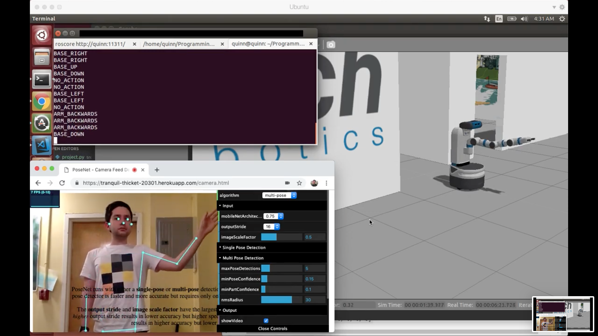
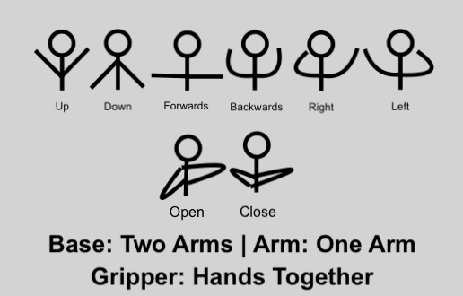

# Humanoid Robots Project - Using PoseNet for 14-Point Control of a Fetch Robot in a Gazebo Simulation

## Overview

### Goal

The goal of this project is to map physical poses, analyzed by [PoseNet](https://github.com/tensorflow/tfjs-models/tree/master/posenet), to actions that share the same physicality on a [Fetch](https://fetchrobotics.com/) robot in a [Gazebo](https://gazebosim.org/) simulation.



Because PoseNet is implemented as a web application, this project contains two separate applications: one for running the web application and related API (`posenet`), and one for reading from the API and translating the data into Fetch instructions (`fetch`).

### PoseNet Process

The web application implementation of PoseNet uses a simple API accessible at `/data` to `POST` and `GET` the latest pose keypoint data as it is being analyzed in real-time through a webcam.

### Fetch Process

The python script inside `fetch` continuously reads from the `/data` API mentioned above, and analyzes those keypoints to decide which pose is currently being made. Examples include tilting your arms to the left or the right, laying your arms at your side, and raising your hands above your head. This translates to Fetch commands: rotating left or right, lowering the base of the robot, and raising the base of the robot.



## Installation

This project requires:
- [Ubuntu 14.04](http://releases.ubuntu.com/14.04/)
- [ROS Indigo](http://wiki.ros.org/indigo)
- [Yarn](https://classic.yarnpkg.com/en/)
- [Heroku](https://dashboard.heroku.com/apps)
- [Python 3.6+](https://www.python.org/)
- [Git](https://git-scm.com/)

## Usage

### 1. Download

```bash
git clone https://github.com/QuinnTorres/university-project--humanoid-robots && cd university-project--humanoid-robots
```

### 2. Deploy the Web Application on Heroku

- Install Heroku using Homebrew: `brew tap heroku/brew && brew install heroku`
- Create an account, then log in and create a new application: `heroku login && heroku create`
- Take the name of the application and edit the URL defined in `WEB_APP_URL` in`demo_util.js`
- Deploy the application: `git push heroku master`

### 3. Build the Fetch Commands Program

- Update `WEB_APP_URL` in `project.py` with the URL of your web application on Heroku
- Boot into Ubuntu
- Download the fetch application and command module: In the `fetch` folder, `mkdir src && cd src && git clone https://github.com/jingxixu/fetch_gazebo.git && git clone https://github.com/cse481wi18/cse481wi18.git)`
- Change to Gazebo 2: `cd fetch_gazebo && git checkout gazebo2`
- Install: `cd ../.. && catkin_make`
- Move the commands file: `mv project.py src/fetch_gazebo/fetch_gazebo_demo/scripts/project.py`
- Add `source devel/setup.bash` to your shell profile

### 4. Run the Fetch Commands Program

- Shell 1: Run `roscore`, to run the command messaging software
- Shell 2: Run `roslaunch fetch_gazebo playground.launch x:=0.0 y:=0.0 z:=0.0`, to run the simulator
- Shell 3: Change directories to where you have moved `project.py` and run `python project.py`, to run the pose -> action software

# Example Output

[View Here](https://youtu.be/zh1kHpN14JA)
